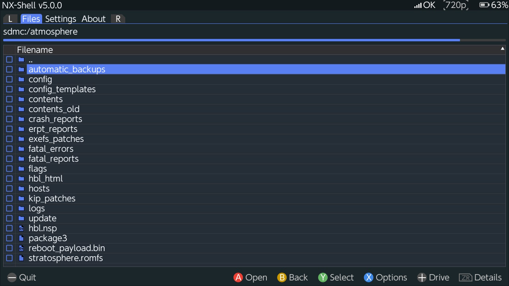
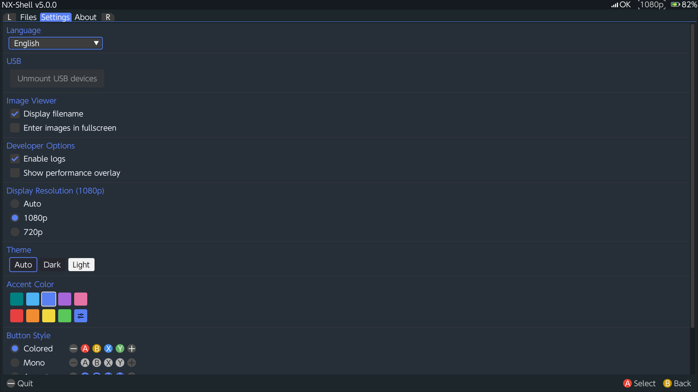

# NX-Shell 

NX Shell is a multi-purpose file manager for the Nintendo Switch that aims towards handling various file types while keeping the basic necessities of a standard file manager. Initially, the project was inspired by LineageOS/CyanogenMod's file manager for android, and even had a similar design approach to that of the famous Android file manager. However, it has been re-written from scratch, now using more up to date tools and libraries.

<p align="center">
  
</p>

<p align="center">
  
</p>

# Features:

- File operations: copy, move, delete, rename, create (with Switch keyboard).
- File properties (size, created/modified/accessed timestamps) and sorting (name, date, size).
- Image viewer with caching (BMP, GIF, JPG, PGM, PPM, PNG, PSD, TGA, WEBP).
- Device browsing: safe, user, system, USB.
- 12 languages: Japanese, English, French, German, Italian, Spanish, Simplified/Traditional Chinese, Korean, Dutch, Portuguese, Russian.
- Native 1080p/720p rendering with configurable overrides.
- Themes: Dark/Light mode, accent colors, button styles.
- Safe Applet Mode and self-updating via GitHub.

# Building:

Requires [devkitPro](https://devkitpro.org/) with Switch development packages installed. Dependencies are fetched automatically via CMake's FetchContent.

```bash
cmake -B build
cmake --build build
```

The output `NX-Shell-vX.Y.Z.nro` will be in the project root.

# Credits:

- [PreetiSketch](https://www.youtube.com/channel/UCxg-ATCKERNRSG87bgjhoqA) for the banner.
- [Omar Cornut](https://github.com/ocornut) and contributors for [Dear ImGui](https://github.com/ocornut/imgui).
- [devkitPro](https://devkitpro.org/) maintainers and contributors for [libnx](https://github.com/switchbrew/libnx), [devkitA64](https://devkitpro.org/wiki/devkitA64), and many other packages used by this project.
- [DarkMatterCore](https://github.com/DarkMatterCore) for [libusbhsfs](https://github.com/DarkMatterCore/libusbhsfs).
- [Sean Barrett](https://github.com/nothings) for [stb_image](https://github.com/nothings/stb).
- [Grzegorz Kostka](https://github.com/gkostka) for [lwext4](https://github.com/gkostka/lwext4) and the [NTFS-3G](https://github.com/tuxera/ntfs-3g) developers.
